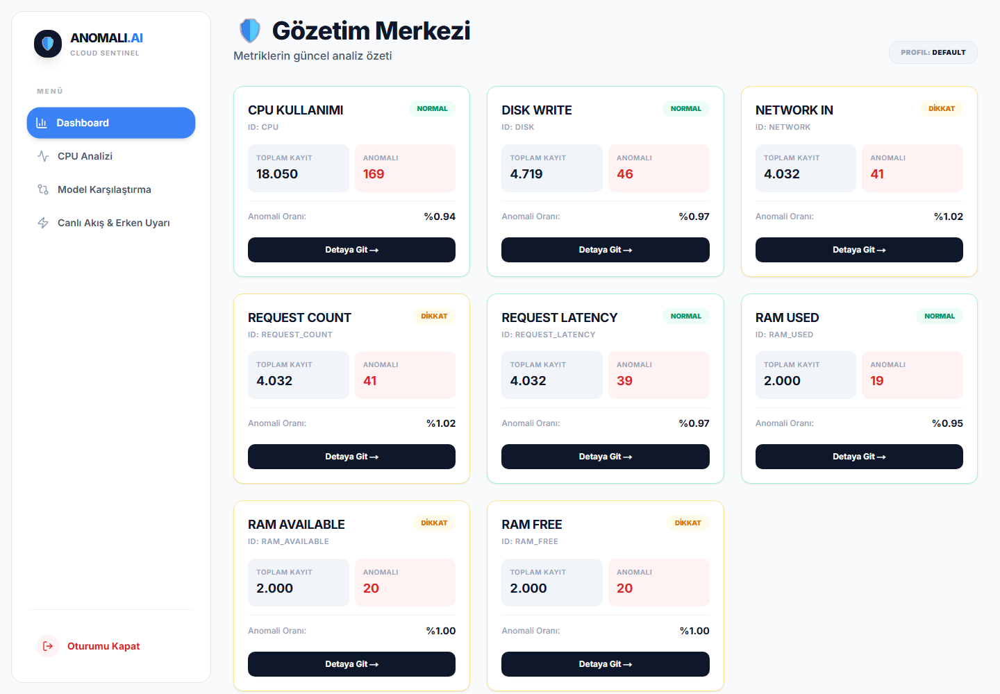
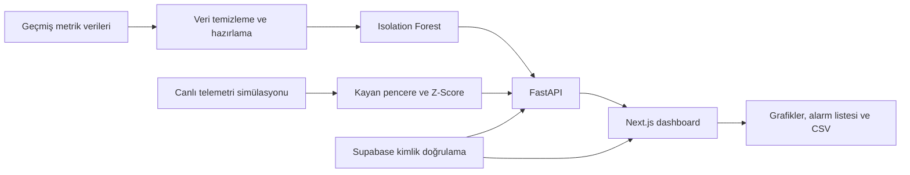
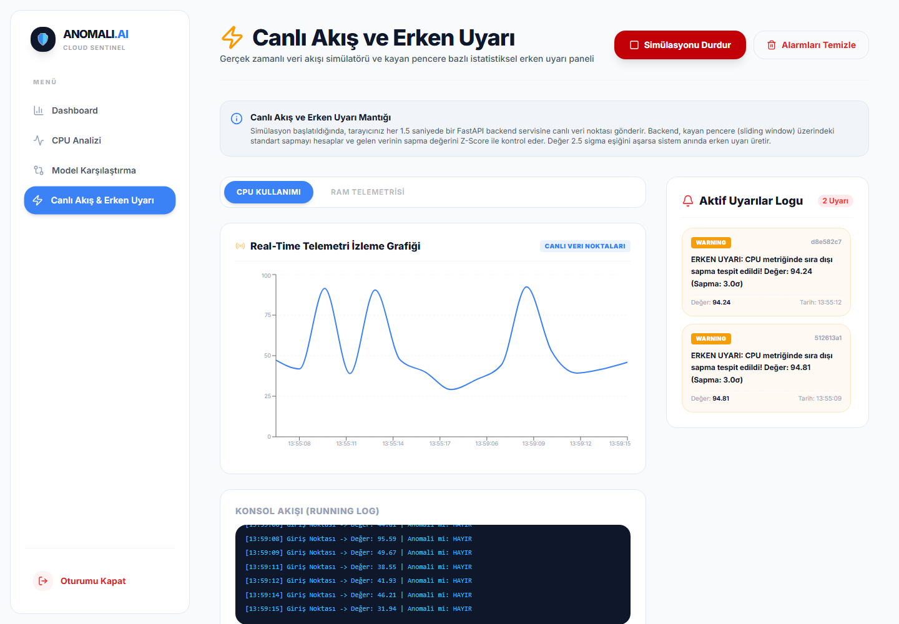

# Bulut Sistemlerinde Yapay Zeka Destekli Anomali Tespiti ve Erken Uyarı Sistemi

**Bulut metriklerinden anlamlı uyarılara.**

Ahmet Yesevi Üniversitesi · Yapay Zeka Yüksek Lisans Dönem Projesi · 2026

**[Proje Raporu · PDF · 65 Sayfa](Omer_Faruk_Uzkal_Donem_Projesi.pdf)** · **[English](#english)** · **[Lisans](LICENSE.md)**

Python · FastAPI · Next.js · Supabase · Isolation Forest

## Proje hakkında

Bulut altyapılarında CPU, bellek, disk, ağ ve istek davranışındaki sapmaları inceleyen; makine öğrenmesi sonuçlarını bir web panelinde sunan akademik bir prototip.

Çalışma, geçmiş zaman serileri üzerinde **Isolation Forest** ile anomali tespitini; **canlı telemetri simülasyonu** üzerinde kayan pencere ve Z-Score tabanlı erken uyarıyla bir araya getirir. Hedef, teknik ekiplerin olağan dışı davranışları daha kolay inceleyebilmesidir.

| Bileşen | İşlev |
| --- | --- |
| Metrik izleme | CPU, disk yazma, ağ girişi, istek sayısı, istek gecikmesi ve üç RAM metriği |
| Anomali analizi | Normal davranıştan ayrılan veri noktalarının işaretlenmesi |
| Model karşılaştırması | Isolation Forest, One-Class SVM, Local Outlier Factor ve Z-Score |
| Erken uyarı | Simüle edilen veri akışında kayan pencereyle sapma kontrolü |
| Erişim yönetimi | Supabase kimlik doğrulaması, JWT ve ADMIN/VIEWER rolleri |
| Raporlama | Metrik grafikleri, anomali tablosu ve CSV dışa aktarma |

## Sistem akışı

## Canlı akış ve erken uyarı

Simülasyonda yeni veri noktaları backend'e iletilir. Kayan pencere üzerindeki sapmalar değerlendirilerek grafik ve alarm listesine yansıtılır. Bu ekran, üretim altyapısına bağlı bir canlı servis iddiası taşımaz.

## Değerlendirme ve sınırlar

Rapor, yöntemleri anomali sayısı, anomali oranı, çalışma süresi ve karar kümeleri arasındaki Jaccard benzerliği üzerinden inceler. Jaccard benzerliği, modellerin aynı noktaları seçme düzeyidir; doğruluk ölçüsü değildir.

Etiketli olay kayıtlarının sınırlı olması nedeniyle precision, recall ve F1-score üzerinden doğrulanmış bir başarı oranı sunulmamaktadır. Gerçek üretim ortamında sürekli izleme ve saha doğrulaması, prototipin ileride geliştirilebilecek yönleridir.

Ekran görüntüleri proje klasöründeki uygulama çıktılarından alınmıştır. Bu depo akademik rapor ve proje tanıtımını içerir; kaynak kod dağıtımı içermez.

## Akademik bilgiler ve rapor

| Alan | Bilgi |
| --- | --- |
| Hazırlayan | **Ömer Faruk UZKAL** |
| Üniversite | Ahmet Yesevi Üniversitesi |
| Program | Yapay Zeka Yüksek Lisans Programı |
| Çalışma türü | Tezsiz Yüksek Lisans Dönem Projesi |
| Danışman | Prof. Dr. Erdal BEKİROĞLU |
| Rapor sürümü | 20 Haziran 2026 · 65 sayfa · Türkçe |

**[Tam proje raporunu görüntüle](Omer_Faruk_Uzkal_Donem_Projesi.pdf)**

Atıf önerisi: Uzkal, Ö. F. (2026). *Bulut Sistemlerinde Yapay Zeka Destekli Anomali Tespiti ve Erken Uyarı Sistemi*. Tezsiz yüksek lisans dönem projesi, Ahmet Yesevi Üniversitesi.

## English

**AI-Supported Anomaly Detection and Early Warning System in Cloud Systems**

An academic prototype developed by **Ömer Faruk Uzkal** for the Artificial Intelligence master's program at Ahmet Yesevi University.

The project combines historical metric analysis using **Isolation Forest**, a **FastAPI** backend, a **Next.js** dashboard and **Supabase** authentication. A separate simulated telemetry flow demonstrates sliding-window, Z-Score-based early warnings.

- Eight metrics covering CPU, disk, network, requests and memory.
- Comparisons with One-Class SVM, Local Outlier Factor and Z-Score.
- Visual anomaly inspection, role-based access and CSV export.
- Evaluation through anomaly rates, execution time and decision-set similarity.

Limited labelled incident data prevents a validated precision/recall/F1 claim. The live stream is a simulation; the project is an academic prototype. This repository publishes the report and showcase materials, not application source code.

**[Read the full report in Turkish — PDF, 65 pages](Omer_Faruk_Uzkal_Donem_Projesi.pdf)**

## Lisans / License

© 2026 Ömer Faruk Uzkal. Bu depodaki özgün rapor, tanıtım metinleri ve proje ekran görüntüleri **[CC BY-NC-ND 4.0](https://creativecommons.org/licenses/by-nc-nd/4.0/)** lisansı kapsamındadır.

Atıf vererek ve lisans koşullarına uyarak ticari olmayan amaçlarla değiştirmeden paylaşabilirsiniz. Uyarlanmış sürümlerin dağıtımı ve lisans kapsamı dışındaki kullanımlar için ayrıca izin gerekir. Üçüncü taraf içerikler, logolar ve atıf yapılan eserler bu lisans kapsamına dahil değildir. Ayrıntılar: [LICENSE.md](LICENSE.md).
